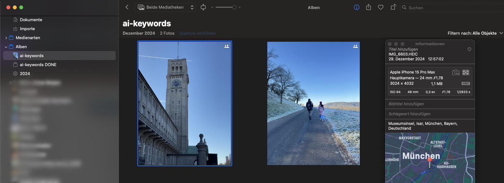
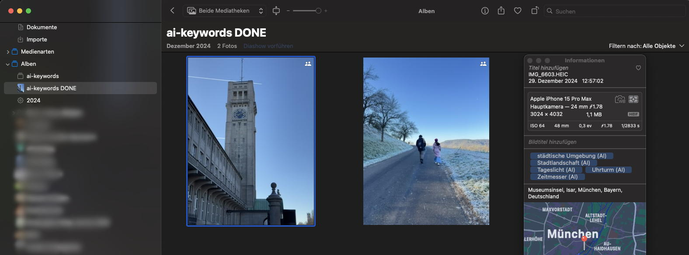

# README for ApplePhotoAiKeywords

## Purpose
This python script adds keywords via a (local) LLM to an iPhoto album.

To set the keywords, the following steps are performed:

- A connection to iPhoto is established.
- Photos are searched for in the album “ai-keywords”. If this album does not exist, it is created.
- The contents of this album are distributed across several working albums, each with a maximum of 99 items, to allow for automatic deletion by iPhoto later without confirmation (thanks, Apple :-(). The initial “ai-keywords” album is completely deleted and recreated empty keeping the working albums for processing.
- We loop over each found working album and each photo in the album is temporarily exported, sent to the LLM for keyword analysis, and processed for keywords.
- After processing, the temporarily downloaded image is deleted.
- Videos are ignored and moved to the album "ai-keywords not DONE"
- If an output language other than English is desired, the keywords are translated into German (via a second LLM call, this is done for a better translation quality).
- All automatically set keywords are appended with “ (AI)” to distinguish them from manually set keywords. If keywords marked in this way already exist on the photo, they are deleted and replaced with the newly found ones.
-	Existing keywords are retained.
-	At the end, all processed photos are moved from the album “ai-keywords” to the album “ai-keywords DONE” or "ai-keywords NOT DONE" (this albums are created if necessary).

The Python program is inspired from the following article in c’t: 
[How a local AI can tag a photo collection on a NAS](https://www.heise.de/ratgeber/Wie-eine-lokale-KI-die-Fotosammlung-auf-dem-NAS-verschlagworten-kann-9685509.html?seite=all)


## Installation

- Python 3 is required.
- The Ollama server must be accessible at `http://127.0.0.1:11434` (either directly or via SSH port forwarding with `ssh -R 11434:localhost:11434 ...`).
- The required models must be installed on the Ollama server by running `ollama pull llava:v1.6` and `ollama pull llama3.1:latest` (or whatever you are using in the LLM_IMAGE_MODEL and LLM_TRANSLATE_MODEL constants)
- Run **`prepare_python.sh`** to create a virtual Python environment and install all needed dependencies from the requirements.txt file.


## Running
- Run run.sh
- Timing on: Mac Book / CPU Appel M3 Pro
    - Analyze image : 3-5 seconds
    - Translate keywords: 0.5-1.5 seconds

iPhoto before:


iPhoto after:



Example run:

```
[xxx@yyy ApplePhotoAiKeywords] $ ./run.sh
Activate penv...
Run python image keywords...
Time to get photos: 0.0 seconds
Working on    : 044FAB4F-9437-4928-9124-242139CC6676 IMG_6603.HEIC
Time to export: 0.3 seconds
Working on file: temporary_ai_photo_export/IMG_6603.jpeg
Scale image...
Base64 image...
Request llm...
Time to get keywords from LLM: 4.2 seconds
Keywords EN =  clock tower, building, architecture, timepiece, cityscape, daytime, clear sky, no people, urban environment, historical structure
Time to translate keywords: 4.0 seconds
Keywords DE = Uhrturm, Gebäude, Architektur, Zeitmesser, Stadtlandschaft, Tageslicht, klare Wolken, keine Menschen, städtische Umgebung, historisches Bauwerk.
New keywords: ['Uhrturm (AI)', 'Gebäude (AI)', 'Architektur (AI)', 'Zeitmesser (AI)', 'Stadtlandschaft (AI)', 'Tageslicht (AI)', 'klare Wolken (AI)', 'keine Menschen (AI)', 'städtische Umgebung (AI)', 'historisches Bauwerk (AI)']
Working on    : D46AA413-8271-47A1-A8FD-31FCFE210D18 IMG_6451.HEIC
Time to export: 0.6 seconds
Working on file: temporary_ai_photo_export/IMG_6451.jpeg
Scale image...
Base64 image...
Request llm...
Time to get keywords from LLM: 2.9 seconds
Keywords EN =  snow, road, people, trees, sky, winter, cold, daytime, outdoor
Time to translate keywords: 1.3 seconds
Keywords DE = Schnee, Straße, Menschen, Bäume, Himmel, Winter, Kälte, Tageslicht, Freiluft
New keywords: ['Schnee (AI)', 'Straße (AI)', 'Menschen (AI)', 'Bäume (AI)', 'Himmel (AI)', 'Winter (AI)', 'Kälte (AI)', 'Tageslicht (AI)', 'Freiluft (AI)']
All done
```

    

## Notes


- If the photos are stored in the cloud, they are automatically downloaded by iPhoto when accessed. Although the application temporarily saves only one photo at a time, iPhoto may keep the photos in the cache for a longer period. Therefore, depending on the situation, it is advisable not to add keywords to too many photos at once, as this might lead to long waits for downloads or cache cleanup. However, processing a few thousend photos at a time does not seem to cause any issues.
- The application does not close the iPhoto app. This appears to cause issues with the photoscript/iPhoto communication, and iPhoto may need to be force-quit afterward. If iPhoto is closed manually, no problems occur.
- After adding keywords, iPhoto starts indexing internally, likely attempting to identify these keywords in other photos. So don’t be surprised if the computer shows additional activity afterward.
- Eventually, this process might become obsolete due to “Apple Intelligence” — let’s wait and see… :-)
- **@Apple**: Your iPhoto API via AppleScript is horrible, shame on you.., please give libraries like photoscript a chance to do their job better... There should be at least a possibility to remove photos from an album and avoid user interactions for adding more than 100 images to an album via AppleScript. 


## ToDo

- Keywords of live images and movies?
- Generate "description" and "title"?
- Maybe cluster the keywords to reduce the number of different keywords?

### Disclaimer:

- This project is not affiliated with, endorsed by, or associated with Apple Inc. iPhoto, Apple Intelligence and AppleScript are a trademarks of Apple Inc.
- I'm not responsible for any data lose, use at your own risk.
